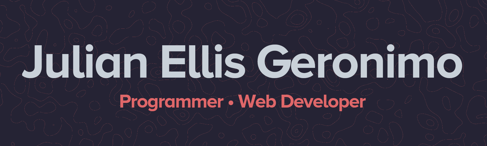

<!-- About me block -->
<!-- Emojis: https://gist.github.com/rxaviers/7360908https://gist.github.com/rxaviers/7360908 -->
  

    <h2>About Me &nbsp; </h2>
     
⁍ &nbsp; Currently a Computer Science student at Brock University :canada:.

     
⁍ &nbsp; My ultimate goal is to be a programming <b>wizard</b>.

     
⁍ &nbsp; Always searching to learn new skills!

  

  

      
<h2 style="margin: 0px;">Interests/Hobbies &nbsp; </h2>

			
:video_game: &nbsp; Gaming enthusiast

			
:snowboarder: &nbsp; Snowboarding

			
🖥️ &nbsp; Graphics Design

			
:japan: &nbsp; Anime/Otaku Culture

			
⌨️ &nbsp; Keyboard tinkering

			
:muscle: &nbsp; Fitness/Gym

    

<h2 align="center">🛠️ Tech Stack</h2>

<!-- Languages/Frameworks -->
<!-- https://github.com/Ileriayo/markdown-badges & https://github.com/alexandresanlim/Badges4-README.md-Profile -->

    
    
    
    
    
    
    
    
    
    

 

<!-- Tools -->

    
    
    
    
    
    
    
    
    
    
    
    
    
     

<h2 align="center">🤓 Nerd Stats</h2>

    

    
    
  

<!-- Social Links -->

<h2 align="center">📷 Socials</h2>
    
    
    
	

<!---
Julellisg/Julellisg is a ✨ special ✨ repository because its `README.md` (this file) appears on your GitHub profile.
You can click the Preview link to take a look at your changes.
--->
